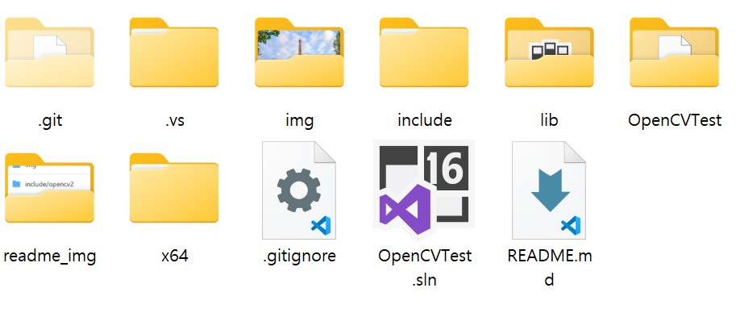
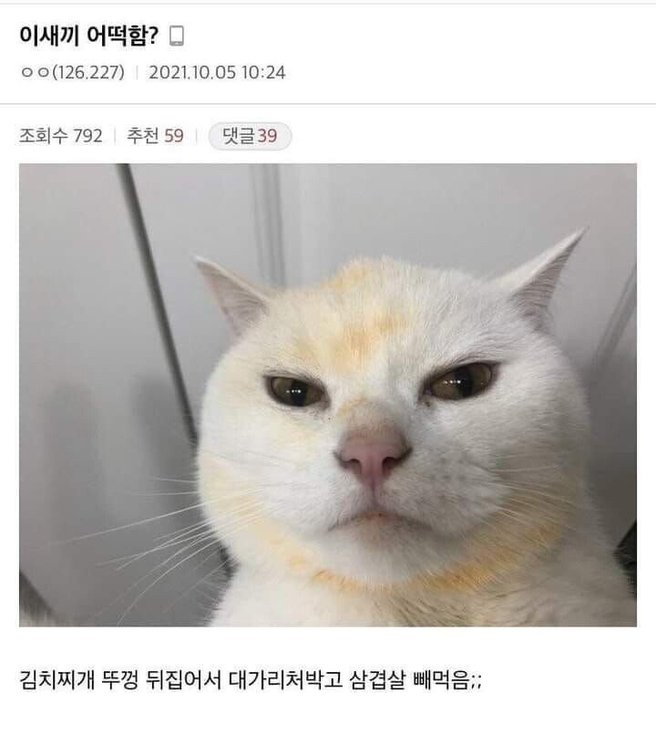
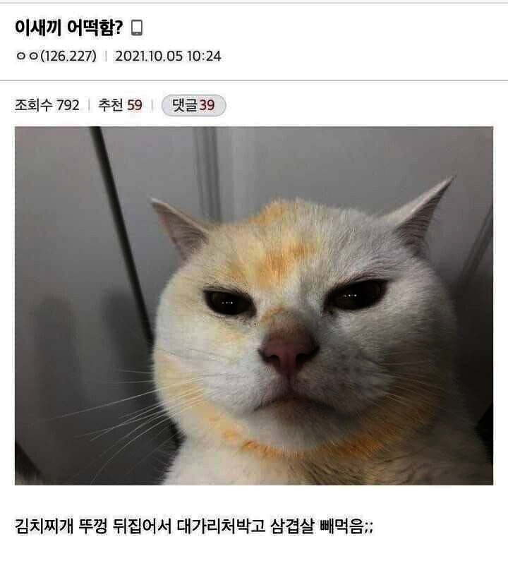
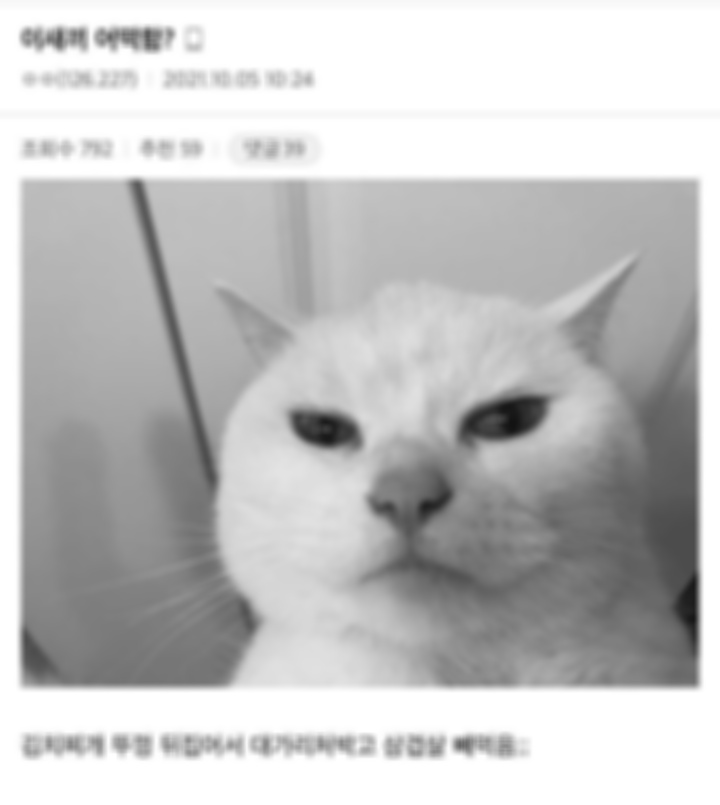

# opencv-playground
학교 '영상처리' 수업을 들으며 OpenCV로 실습하고 공부한 내용들을 기록한 레포지토리입니다.

# 라이브러리 세팅 및 실행 방법
Visual Studio 2019 기준, 해당 블로그 글(추후링크추가)에 정리해 놓았습니다.  
(vscode로 하려면 tasks.json과 makefile을 다뤄야 해서 복잡.)

# 폴더 구조

- img: 이미지 폴더.
- include/opencv2: opencv 라이브러리 폴더.
- lib: 빌드된 라이브러리 폴더. **위 블로그 글 참고해, 직접 폴더 생성 후 lib 파일 넣어줘야함.**
- x64: 프로젝트 디버그 및 릴리즈 폴더. **위 블로그 글 참고해, x86으로 프로젝트 빌드하면 자동생성되며 해당 폴더 내에 dll 파일 직접 넣어줘야함.**
- OpenCVTest: cpp 소스 코드 폴더.
- OpenCVTest.sln: Visual Studio 프로젝트 실행 파일.
- .vs: Visual Studio 설정 및 캐시 폴더.

# 개별 소스 코드 설명

## 1-basic-opencv.cpp

opencv로 이미지를 열어서 화면에 원본 이미지를 보여주는 기본적인 opencv 코드.  

즉, 위의 이미지가 우리의 원본 이미지임.

## 1-2-gamma-correction.cpp

실제 우리가 보는 이미지는 감마 보정이 적용된 이미지임(블로그링크추가).  

감마 보정하여 모니터에 출력 및 역보정하여 저장하는 것을 구현한 코드.

## 2-box-filter.cpp

박스 필터를 구현한 코드. 필터 크기 조절이 가능하다.  위에 사진은 4x4 필터 사용.  

필터 크기 (0, 0)으로 하면, 그냥 원본 흑백 이미지와 동일한 결과가 나옴.

## 3-gaussian-filter.cpp

가우시안 필터를 구현한 코드. 필터 크기 및 sigma 조절이 가능하다. 위에 이미지는 5x5 필터에 sigma값 5 사용.  

보면 box filter랑 비교해봤을 때, 엣지도 잘 보존되고 훨씬 부드럽게 출력된 걸 볼 수 있다.
